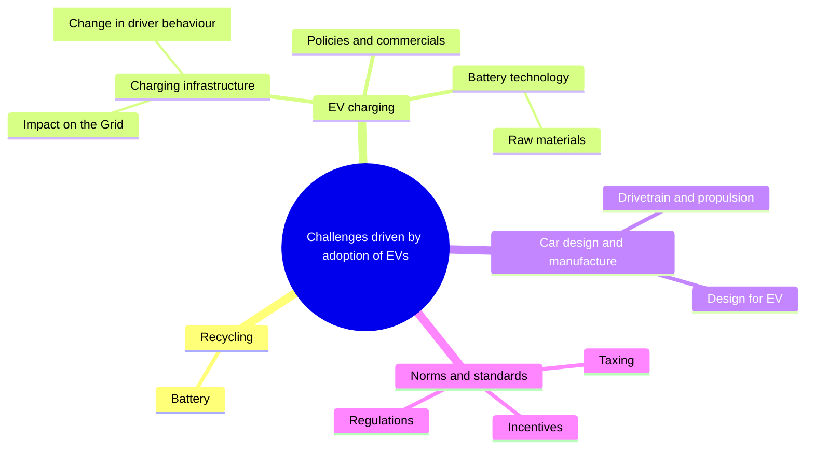
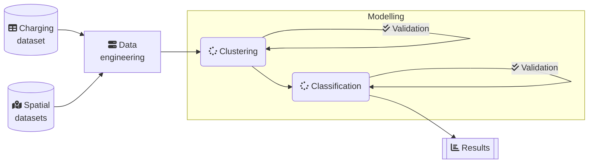
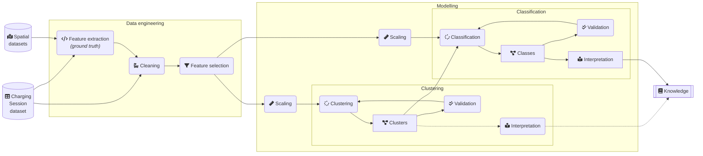

# Charts and diagrams

Charts and diagrams used in the dissertation are created using [Mermaid](https://mermaid-js.github.io/mermaid/#/).

## Challenges

### Mind map of selected challenges driven by EV adoption

## Analytic framework

### Simple version of the analytic framework

### A more detailed version of the analytic framework

