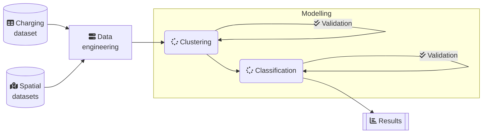

# Introduction

This repository hosts notebooks and scripts used for my dissertation project for the MRes Spatial Data Science and Visualizations CASA, UCL.

## Preamble

Due to the nature of the project, some data files, scripts and notebooks are not included in this public repository. Code is provided for reference only, and will not run without the missing files. The following sections provide a brief overview of the study, and the code used to produce the results.

## Index

- [Abstract](#abstract)
- [Code](#code)
  - [Analytic framework](#analytic-framework)
  - [Notebooks](#notebooks)
  - [Dependencies](#dependencies)
- [Data](#data)
- [Notes](#notes)
- [Contact](#contact)

## Abstract

### Data Analysis of Electric Vehicle Charging Points Usage Patterns – Proposing a Classification Model on POI features

The ever-increasing rate of Electric Vehicles (EV) adoption inducted a rapid expansion of charging systems and led to a heterogenous landscape where numerous operators are maintaining networks consisting of powerful charging stations on commercial sites as well as traditional in-home devices. This research provides an in-depth analysis of charging data and presents a clustering aided classification approach of EV chargers based on their usage patterns. The focus of this paper is two-fold: the first objective is finding a way for identifying attributes describing similarities across user groups that define charger station categories. The second objective is to propose an optimised classification model for predicting use patterns of charging stations, that is trained on metadata of clustering outcomes and based on point of interest information. As a result, we demonstrate that the presented method can be effectively used on real-world data of a Belgian network operator for accurately estimating customer behaviour at new EV charging points.

# Code

We are providing the code used for the analysis in this repository. The code is written in Python, and is provided in the form of Jupyter notebooks, numbered in the order of execution.

## Analytic framework

We set the following simplified pipeline for the analysis:

## Notebooks

Notebooks and scripts provided are used for carrying out the steps of the analysis as described. The following notebooks are included:

|File|Details|
|---|---|
|`00_Charts.md`|Markdown document with Mermaid code describing charts and diagrams|
|`01_Charging_Stations_from_OSM.ipynb`|Extracting static charging stations data from OpenStreetMap|
|`02_Charging_Sessions_from_NETWORK_OPERATOR.ipynb`|Loading, cleaning, joining and persisting charging session information received from the a network operator|
|`03_Tagging_Charging_Stations.ipynb`|Tagging charging stations with POI information using distance based spatial joins, forward and reverse geocoding|
|`04_Visualizations.ipynb`|A few visualizations used for displaying statistical information of the datasets|
|`05_Clustering_Charging_Sessions.ipynb`|Clustering charging sessions based on usage patterns|
|`06_Classification_of_Charging_Stations.ipynb`|Classification of charging stations based on spatial features, using cluster interpretations of the previous step|

## Dependencies

Notebooks of this repository are using the following Python libraries:

- `numpy`
- `pandas`
- `pyarrow`
- `openpyxl`
- `pathlib`
- `JSON`
- `matplotlib`
- `seaborn`
- `plotly`
- `kaleido`
- `geopandas`
- `overpy`
- `sklearn`
- `scipy`
- `contextily`

# Data

Some data files are not included in this repository due to access restrictions. The following sets are replicated in the `data/` folder:

- `data/EUROSTAT-ref-countries-2020-01m-shp/` - Boundaries of European countries
- `data/UC/Bel_adm2.shp` - Administrative boundaries of Belgium

References to the data used, data sources and their owners are provided in the notebooks.

# Notes

Executing some of the notebooks may take a long time, depending on the hardware used. Also, preparations for geocoding, as well as performing forward and reverse geocoding is really resource intensive. Building OSM replicas can take hours, and can use up to 20GB of RAM and 100GB of disk space.

# Contact

Andras Gelanyi - [E-mail](mailto:agelanyi@gmail.com) - [LinkedIn](https://www.linkedin.com/in/andrasgelanyi/)

Project Link: [https://github.com/agelanyi/CASA0004-Dissertation](https://github.com/agelanyi/CASA0004-Dissertation)